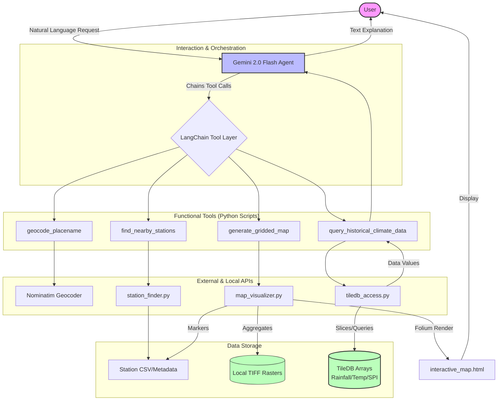
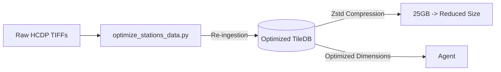

# HCDP Project Workflow Visualization

This document visualizes the architecture and operational flow of the Hawaii Climate Data Portal (HCDP) AI Assistant.

## System Architecture

The following diagram illustrates how the Gemini-powered agent interacts with the HCDP API, the high-performance TileDB database, and local raster data to serve user requests.

## Data Ingestion & Optimization Flow

The project also includes a specialized workflow for optimizing storage efficiency by converting raw TIFFs into compressed TileDB arrays.

> [!TIP]
> **TileDB Efficiency**: The TileDB arrays allow the agent to query a single "pixel" across 30+ years of data without loading entire TIFF files into memory, enabling near-instant response times for historical climate queries.
